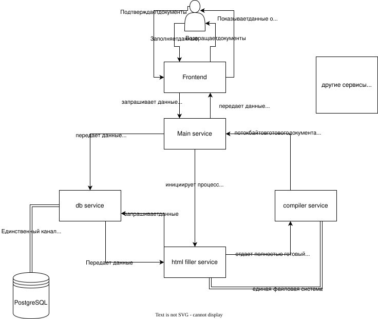

# Рекомендованные технологии

В ветках main и dev мы использовали docker. Если вам это нравится, продолжайте его использовать, но легче и проще использовать systemd units:

1. Создайте непривилегированного системного пользователя (или если понадобится - несколько)
2. Запускайте только от его имени все процессы
3. Пропишите юниты для автоматического запуска (учтите, что база данных должна быть полностью готова перед запуском бэка)
4. Пользуйтесь, и смотрите логи в `journalctl`

Это предлагается сделать в основном для использования общей файловой системы. Вам понадобится придумать способ, как избежать "драк" за один и тот же файл (например, называйте их хэшами текущего момента, или если не хэшами, то просто таймкодом, номером шаблона, хэшем пользователя и др.)

# ТЗ от сотрудников дис. совета

Должны существовать два вида пользователей: те, кто пользуется сервисом для своего удобства (соискатели на кандидатскую/докторскую степень) и сотрудники дис. совета (те, кто подтверждают и, может, подписывают документы). Для первых может быть предусмотрена регистрация, для вторых - нет.

Поскольку некоторые документы требуют данные от оппонентов, научных руководителей/консультантов, для них, как и для соискателей, должна быть предусмотрена регистрация и возможность заполнения своих документов (например, согласие оппонента, сведения о научном руководителе и др.)

В любом случае, уточняйте подробности ТЗ у наставника и сотрудников дис. совета

# Примерная схема того, как это должно работать

Изменяйте схему работы по своему усмотрению.
